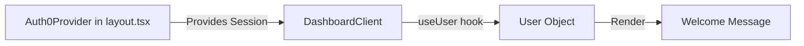

# Requirements

### Overview & Goals
Replace the hardcoded welcome message "Alex" in the dashboard with the actual name of the logged-in user retrieved from Auth0.

### Scope
- **In Scope**:
    - Integrating the `useUser` hook into `DashboardClient`.
    - Updating the greeting message in the dashboard header.
- **Out of Scope**:
    - Modifying the mock task assignment data (e.g., changing "u1" assignments to match the logged-in user).
    - Implementing a full profile management system.

# Technical Design

### Current Implementation
- `app/dashboard/dashboard-client.tsx` contains a hardcoded `<h1>` tag: `Good morning, Alex! 👋`.
- `app/layout.tsx` already wraps the application in an `Auth0Provider`, making user data available via context to client components.

### Key Decisions
- **Use `useUser` Hook**: We will use the client-side hook provided by `@auth0/nextjs-auth0` for consistency with other parts of the app (like the landing page) and to keep the component's data source local to the client.

### Proposed Changes
- **File**: `app/dashboard/dashboard-client.tsx`
    - Add `import { useUser } from "@auth0/nextjs-auth0/client";`.
    - Retrieve the user object: `const { user } = useUser();`.
    - Update the greeting: `Good morning{user?.given_name || user?.name ? `, ${user.given_name || user.name}` : ''}! 👋`.
        - *Note: Auth0 often provides `given_name` for a more personal greeting. If no name is found, it falls back to "Good morning!".*

### Architecture Diagram

# Testing

### Validation Approach
- Verify that the greeting message displays the correct name when logged in.
- Verify that it falls back to just "Good morning!" if the name is unavailable.

### Key Scenarios
- **Logged In User**: Greeting should show "Good morning, [Name]!".
- **Missing Name in Profile**: Greeting should show "Good morning!".

# Delivery Steps

### ✓ Step 1: Import and initialize useUser hook in DashboardClient
The `DashboardClient` component has access to the Auth0 hook and user data.
- Import `useUser` from `@auth0/nextjs-auth0/client` in `app/dashboard/dashboard-client.tsx`.
- Call `useUser()` at the top of the component to retrieve the `user` object.

### ✓ Step 2: Update welcome message with user name
The welcome message dynamically displays the logged-in user's name.
- Locate the hardcoded "Alex" in the `h1` tag within the header section.
- Replace the text with dynamic logic: `Good morning{name ? `, ${name}` : ''}! 👋` (where `name` is the user's name).
- Ensure the welcome message gracefully handles the loading state if necessary (though it should be hydrated from the server).