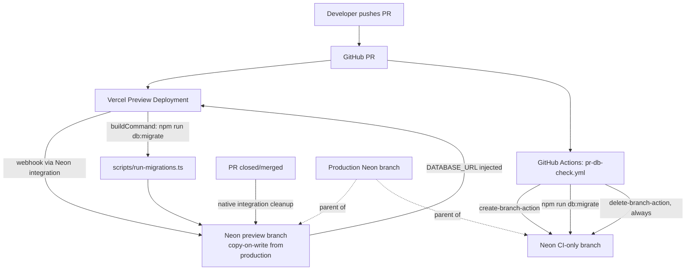

# Requirements

### Overview & Goals
Define and implement a repeatable process so every GitHub pull request against chorez gets:
1. A Vercel Preview Deployment (already Vercel's native behaviour once the project is connected to GitHub).
2. An isolated Neon Postgres branch, copy-on-write from the production branch, wired to that preview deployment.
3. Automatic application of any new `migrations/*.sql` files to that isolated branch during the preview build.
4. A CI safety net that validates migrations even if nobody opens the preview URL.

Because the preview's Neon branch is a copy-on-write clone of production, existing households/users/chores are visible (so a tester can log in with their real account and see their real data), but any schema changes or test data written during PR review live only on that branch's deltas and are discarded when the branch is deleted — production is never touched.

### Scope
**In scope**
- A migration runner script that can be invoked on any branch (prod or preview) and only applies migrations not yet recorded as applied.
- A `schema_migrations` ledger table + bootstrap migration so the existing 10 migrations are recorded as a baseline.
- `vercel.json` build command override so Vercel runs the migration runner before `next build` on every deployment (prod and preview alike).
- A GitHub Actions workflow that spins up a throwaway Neon branch per PR, runs the migration runner against it, and tears the branch down — independent of Vercel/whether the preview was opened.
- Documentation (README) of the one-time dashboard steps to install Neon's "Neon-Managed (Connectable Account)" Vercel integration and enable automated preview branching, plus the resulting per-PR lifecycle.

**Out of scope**
- Actually installing the Vercel Marketplace integration or connecting the Vercel project (dashboard-only actions outside repo code — documented as manual setup steps for a human with account access).
- Any change to production migration semantics beyond adding the tracking table.
- Seeding preview branches with synthetic test data.

### User Stories
- As a developer opening a PR with a schema change, I want the preview deployment to automatically run my new migration against an isolated database so I can verify it visually before merge.
- As a reviewer, I want to log into the preview URL with my existing chorez account and see my real households/chores, so I can sanity-check the feature against realistic data.
- As a maintainer, I want any data or schema changes made while testing a PR to disappear when the PR is closed, so production data and schema are never at risk.
- As a maintainer, I want a CI check that fails a PR automatically if its migration is broken, even if I never open the preview link.

### Functional Requirements
- Every open PR gets a Vercel Preview Deployment (existing Vercel/GitHub behaviour, no change needed).
- Every Vercel deployment (preview and production) runs `npm run db:migrate` before `next build`, applying only migrations not already recorded for that specific branch's database.
- A fresh preview branch inherits production's `schema_migrations` rows via Neon's copy-on-write, so only migrations added by the PR itself actually execute against it.
- Neon preview branches are automatically deleted when their Vercel preview deployment/branch is removed (native integration behaviour).
- A GitHub Actions check (`.github/workflows/pr-db-check.yml`) creates a short-lived Neon branch per PR, runs the migration runner against it, reports pass/fail as a PR status check, and always deletes the branch afterward.

# Technical Design

### Current Implementation
- `migrations/*.sql` (`0001`–`0010`) are hand-written, sequentially numbered, forward-only SQL files with **no runner and no applied-state tracking** — they're applied manually via the `db-agent` sub-agent using the Neon MCP server (see `.junie/agents/db-agent.md`).
- `lib/db.ts` exports a single `sql` tagged-template client built from `@neondatabase/serverless`'s HTTP-based `neon()` function — fine for single-statement app queries, but not suited for running a whole multi-statement migration file in one call.
- The repo is already linked to a Neon project (`.neon` → project `weathered-fire-58402851`), but there is no `vercel.json`, no `.github/workflows/`, and no documented Vercel connection yet — this process establishes both.

### Key Decisions
1. **Provisioning approach: Neon-Managed ("Connectable Account") Vercel integration**, linking chorez's *existing* Neon project rather than the marketplace-provisioned "Vercel-Managed" option (which would create a brand-new Neon org) or a fully custom GitHub-Actions-driven webhook pipeline. This is a one-time dashboard setup (Vercel → Marketplace → Neon → "Link Existing Neon Account", then enable **Preview Branching** + **Automatically delete obsolete branches** for the connected Vercel project) and requires no new webhook code; Neon injects `DATABASE_URL`/`DATABASE_URL_UNPOOLED` into each preview deployment automatically.
2. **Migration execution: a small tracked runner, not blind re-execution.** Add `scripts/run-migrations.ts` plus a `schema_migrations(filename text primary key, applied_at timestamptz)` ledger table (`migrations/0011_schema_migrations_table.sql`). On first run against a branch that already has the domain tables (e.g. `households`) but no ledger rows, the script *bootstraps* by recording all existing `migrations/*.sql` filenames as already-applied without re-executing them; on subsequent runs (including on a freshly branched preview, which inherits the ledger via copy-on-write) it only executes files not yet in the ledger. This avoids requiring every historical migration to be idempotent while still being safe to run on every build.
3. **Migration invocation: `vercel.json` build command override**, not a dashboard-only setting, so the build step is versioned with the code: `"buildCommand": "npm run db:migrate && next build"`. The script uses `Client` from `@neondatabase/serverless` (node-postgres compatible, supports multi-statement simple-query execution) against `DATABASE_URL_UNPOOLED`, per Neon's guidance to use a direct connection for schema migrations.
4. **CI safety net: dedicated GitHub Actions workflow** using Neon's official `create-branch-action` / `delete-branch-action`, independent of Vercel. This catches broken migrations on every PR push regardless of whether a human opens the preview URL, and always tears its branch down (even on failure) so it never accumulates orphaned branches the way Vercel-deployment-tied branches can.

### Proposed Changes
- **`migrations/0011_schema_migrations_table.sql`**: `CREATE TABLE IF NOT EXISTS schema_migrations (filename text PRIMARY KEY, applied_at timestamptz NOT NULL DEFAULT now())`. No RLS needed (internal tooling table, never queried by app code / not exposed to `current_household_id()`-scoped roles).
- **`scripts/run-migrations.ts`**: connects with `Client` from `@neondatabase/serverless`, ensures the ledger table exists, bootstraps baseline rows if the ledger is empty but domain tables already exist, then loops over `migrations/*.sql` sorted by filename, running each not-yet-applied file inside a transaction and recording it in `schema_migrations` on success. Exits with a non-zero code and a clear message on any SQL error (so both Vercel builds and the CI workflow fail loudly).
- **`package.json`**: add `"db:migrate": "tsx scripts/run-migrations.ts"` script and `tsx` as a devDependency (keeps the script in TypeScript, consistent with the rest of the repo, without adding a full bundler step).
- **`vercel.json`** (new): `{ "buildCommand": "npm run db:migrate && next build" }` — applies to production and every preview deployment alike.
- **`.github/workflows/pr-db-check.yml`** (new): on `pull_request` (opened/synchronize), uses `neondatabase/create-branch-action` (parented off the project's primary branch) to create `preview-ci/pr-${{ github.event.number }}`, runs `npm run db:migrate` against that branch's connection string, then always runs `neondatabase/delete-branch-action` to clean up, using a `NEON_API_KEY` repo secret and the existing `.neon` project id.
- **README.md**: new "Preview Deployments & Database Branching" section documenting the one-time Vercel/Neon dashboard setup, the resulting per-PR lifecycle (branch created → migrations applied → branch deleted on PR close), and the guarantee that production data/schema is never affected.
- **AGENTS.md**: one-line pointer from the existing `migrations/*.sql` bullet to the new README section and `scripts/run-migrations.ts`, matching the file's existing "read it directly" convention.

### File Structure
```
migrations/
  0011_schema_migrations_table.sql   (new)
scripts/
  run-migrations.ts                  (new)
  run-migrations.test.ts             (new)
vercel.json                          (new)
.github/
  workflows/
    pr-db-check.yml                  (new)
package.json                         (modified: db:migrate script, tsx devDependency)
README.md                            (modified: new section)
AGENTS.md                            (modified: one-line pointer)
```

### Architecture Diagram


### Risks
- **Vercel Marketplace install is a manual, dashboard-only step** — the plan documents exactly what to click, but it must be performed once by someone with Vercel/Neon account access; the repo changes alone don't activate preview branching.
- **Bootstrap detection heuristic**: the runner decides "already-applied baseline" by checking for an existing domain table; if that heuristic is ever wrong on an unusual branch, migrations could be skipped or double-run. Mitigated by making every future migration additionally safe to no-op if reapplied (`IF NOT EXISTS` etc.), matching `db-agent`'s existing RLS conventions.
- **CI branch churn**: the safety-net workflow creates/destroys a Neon branch on every push to a PR; mitigated by always running the delete step (`if: always()`) and reusing a per-PR branch name so re-pushes update rather than multiply branches.

# Testing

### Validation Approach
Agent-verifiable checks focus on the new migration runner logic (pure Node/TS, mockable DB client) and the static shape of the new config files; the live Vercel/Neon integration itself can only be verified after the manual dashboard install, so it's documented rather than agent-tested.

### Key Scenarios
- `run-migrations.test.ts` (Vitest, mocking the `@neondatabase/serverless` `Client` the same way `lib/db.ts` is mocked elsewhere): 
  - Bootstraps correctly when `schema_migrations` is empty but a known domain table already exists — records all existing files without executing their SQL.
  - On a branch with an existing ledger, only executes files not already recorded, in filename order.
  - Records a filename in `schema_migrations` only after its file's SQL succeeds; a failing file leaves the ledger unchanged and causes the process to exit non-zero.
- `npm run lint` and `npm test` pass after adding `scripts/run-migrations.ts`, `vercel.json`, and the workflow file.

### Edge Cases
- Empty `migrations/` beyond the current files (no-op run) still exits 0.
- Re-running the script twice in a row against the same branch is a no-op the second time (idempotency of the ledger, not of the SQL itself).
- Workflow YAML cleans up its Neon branch even when the migration step fails (`if: always()` on the delete step).

# Delivery Steps

### ✓ Step 1: Add a tracked migration runner script
A new script can apply pending SQL migrations to any Neon branch (prod or preview) exactly once, without needing every historical migration to be idempotent.
- Add `migrations/0011_schema_migrations_table.sql` creating `schema_migrations(filename text primary key, applied_at timestamptz)`.
- Add `scripts/run-migrations.ts` using `Client` from `@neondatabase/serverless` against `DATABASE_URL_UNPOOLED`: ensures the ledger table exists, bootstraps baseline rows when domain tables already exist but the ledger is empty, then applies each not-yet-recorded `migrations/*.sql` file inside a transaction and records it on success.
- Exit non-zero with a clear error message on any SQL failure so callers (Vercel build, CI) fail loudly.
- Add `tsx` as a devDependency and a `"db:migrate": "tsx scripts/run-migrations.ts"` script in `package.json`.

### ✓ Step 2: Unit test the migration runner
The runner's bootstrap and apply-only-pending logic is verified without touching a real database.
- Add `scripts/run-migrations.test.ts`, mocking the `@neondatabase/serverless` `Client` the way `lib/db.ts` is mocked elsewhere in the repo.
- Cover: bootstrap-from-existing-schema, skip-already-applied, apply-new-file-and-record, and failure-leaves-ledger-unchanged-and-exits-non-zero scenarios.
- Run `npm test` and `npm run lint` to confirm the new script and tests are clean.

### ✓ Step 3: Wire the migration runner into every Vercel build
Every Vercel deployment (production and preview alike) runs pending migrations before building the app.
- Add `vercel.json` with `"buildCommand": "npm run db:migrate && next build"`.
- Document, in the new README section, the one-time manual step of installing Neon's "Neon-Managed (Connectable Account)" Vercel integration on the existing Neon project and enabling automated Preview Branching + automatic obsolete-branch cleanup.

### ✓ Step 4: Add a CI safety-net workflow for PR migrations
PRs get an automated pass/fail signal on their migrations even if the Vercel preview is never opened.
- Add `.github/workflows/pr-db-check.yml`, triggered on `pull_request` (opened/synchronize).
- Use `neondatabase/create-branch-action` to create a per-PR branch off the project's primary branch, run `npm run db:migrate` against it, then always run `neondatabase/delete-branch-action` to clean up (`if: always()`).
- Reference a `NEON_API_KEY` repo secret and the project id from `.neon` in the workflow inputs.

### ✓ Step 5: Document the end-to-end preview PR process
The full lifecycle is written down so any contributor understands what happens automatically per PR.
- Add a "Preview Deployments & Database Branching" section to `README.md` covering: the one-time dashboard setup, the per-PR lifecycle (branch created → migrations applied → branch deleted on PR close), and the guarantee that existing users/data remain visible on previews while schema/data changes stay isolated from production.
- Add a one-line pointer from `AGENTS.md`'s `migrations/*.sql` bullet to the new README section and `scripts/run-migrations.ts`, consistent with the file's existing "read it directly, don't duplicate" convention.