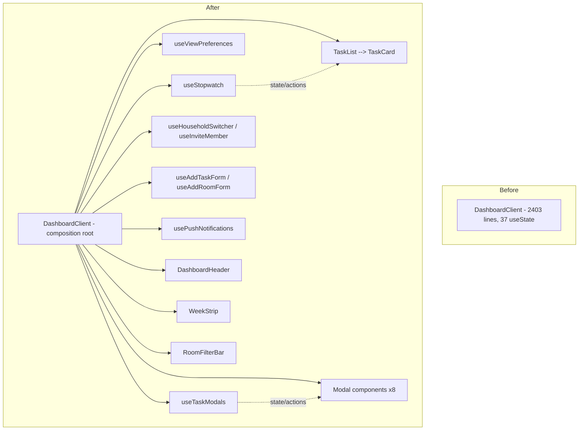

# Requirements

### Overview & Goals
Review the Chorez React/Next.js codebase against the Vercel React best-practices and composition-pattern guidelines, and produce a concrete, staged refactor plan. The refactor must not change any user-facing behavior; every extraction/reorganization step is backed by regression tests written **before or alongside** the change, since the project currently has **zero automated tests** (`package.json` has no test script, no `vitest`/`jest` dependency, no `*.test.ts(x)` files anywhere).

The single biggest offender is `app/dashboard/dashboard-client.tsx`: a 2,403-line `"use client"` component with **37 `useState` calls**, 4 `useEffect`s (one combining 4 unrelated persistence concerns), and a ~1,500-line JSX return that renders 8+ modals inline via scattered `isXOpen` booleans. `app/page.tsx` (491 lines) is marked `"use client"` at the top even though only two of its seven sections need client-side auth state. `lib/scheduling.ts` and `lib/actions/*.ts` are comparatively well-structured (pure helpers, `React.cache` already used in `getDbUser`, `Promise.all` already used in `app/dashboard/page.tsx`) and mainly need test coverage rather than restructuring.

### Scope
**In scope**
- `app/dashboard/dashboard-client.tsx` (primary target): decompose into hooks + presentational components.
- `app/page.tsx`: convert to a Server Component shell with small client islands.
- `lib/scheduling.ts`, `lib/actions/chore-actions.ts`, `lib/actions/user-actions.ts`: add regression tests for existing pure/branching logic; no structural changes beyond what's needed for testability.
- New Vitest + React Testing Library test infrastructure (none exists today).

**Out of scope**
- Visual/design changes, new features, database schema changes.
- `app/api/**` cron/webhook routes and `lib/gemini.ts`/`lib/auth0.ts` (reviewed, no significant React best-practice violations found there).
- End-to-end/Playwright tests (unit + component tests via Vitest/RTL only, per decision below).

### User Stories
- As a developer, I want `dashboard-client.tsx` broken into small hooks and components so that I can change one feature (e.g. the stopwatch) without risking unrelated ones (e.g. invite modal).
- As a developer, I want a regression test suite in place before refactoring so that behavior parity is provable, not just visually inspected.
- As a developer, I want the marketing landing page to ship less client JavaScript so initial load is faster.

### Functional Requirements
- Every refactor stage must leave existing behavior (data displayed, actions triggered, optimistic UI, persistence) unchanged, verified by tests that pass **before and after** the change.
- All currently-inline pure helpers (date/formatting logic) and shared types must be extracted with 1:1 behavior parity and covered by unit tests.
- Modal/dialog UI must be converted from boolean-flag-driven inline blocks to explicit, independently testable components.
- The landing page must render identical markup/content after removing the blanket `"use client"` directive.

### Non-Functional Requirements
- No new runtime dependencies beyond testing tooling (Vitest, Testing Library) and the React plugin needed to run it.
- `npm run lint` and `next build` must stay green after every stage.
- Test suite must run fast enough for per-stage iteration (unit/component tests, jsdom, no real network/DB calls — the `sql` tag from `lib/db.ts` and `auth0` session are mocked at the boundary).

# Technical Design

### Current Implementation — Key Findings

**`app/dashboard/dashboard-client.tsx`**
- Lines 295-441: 37 `useState` declarations covering unrelated concerns in one function body: stopwatch, favorites, task completion, household switcher, invitations, invite-member modal, add-task form, add-room form, push notifications, profile modal.
- Lines 350-362: a single `useEffect` writes `viewMode`, `currentWeekStart`, `selectedDay`, `selectedRoom` to both `localStorage` and `document.cookie` on *any* of the four changing — violates splitting hooks by independent concern (`rerender-split-combined-hooks`) and has no schema/versioning for the stored values (`client-localstorage-schema`).
- Lines 366-379 and 455-475: effects use `// eslint-disable-next-line react-hooks/set-state-in-effect` to silence warnings rather than restructure the effect (`rerender-derived-state-no-effect`, `rerender-move-effect-to-event`).
- Lines 524-538: `filteredTasks`/`incompleteTasksCount` are correctly memoized, but depend on the whole `initialDbUser` object where only `initialDbUser?.id` is read (`rerender-dependencies` — prefer primitives).
- No sub-components are extracted anywhere in the file (confirmed: no capitalized function/const component definitions besides `DashboardClient` itself) — the entire ~1,500-line JSX return (lines 899-2403) re-renders as one tree on every state change; 8+ modals (Profile, Invite, Add Task, Add Room, Complete Task, Edit Frequency, Edit Room, Delete Chore confirm) are each gated by an `isXOpen &&`/`AnimatePresence` block instead of being their own components (`architecture-compound-components`, `patterns-explicit-variants`).
- `Task`, `Room`, `HouseholdUser`, `DbUser`, `Invitation`, `Household` types are defined inline in this client component (lines 180-238) and consumed by `app/dashboard/page.tsx` via `as unknown as Task[]`-style casts — no single source of truth for the data contract.

**`app/page.tsx`**
- `"use client"` at line 1 makes the entire 491-line landing page (including fully static sections `Features`, `HowItWorks`, `CtaBanner`, `Footer`, `RoomStrip`, `Logo`) ship as client JS, even though only `Navbar` (line 112) and `Hero` (line 141) call `useUser()`. This forgoes RSC streaming/server rendering for content that never changes (`bundle-*`, `async-suspense-boundaries`).

**`lib/scheduling.ts` / `lib/actions/*.ts` (good reference patterns, mainly need tests)**
- `lib/scheduling.ts` already isolates pure, DB-free functions (`calculateNextDueDate`, `isMoreFrequentThanWeekly`, `toDateStr`, `addDaysToDateStr`, `formatDateInTz`, `getMissingRecurringDates`) — ideal, already-decoupled regression-test targets.
- `lib/actions/user-actions.ts:48` wraps `getDbUser` in React's `cache()` — correct use of `server-cache-react`.
- `app/dashboard/page.tsx:21` already uses `Promise.all` to parallelize 8 independent server fetches — correct use of `async-parallel`.

### Key Decisions
1. **Scope: full app + lib audit** (not just the dashboard component) — confirmed with stakeholder. Includes the landing page and lib/ testability, not just the dashboard.
2. **Regression testing: Vitest + React Testing Library** — matches the project's available Vitest skill, integrates with the existing Vite-compatible TS/JSX toolchain, and is fast enough to run after every extraction step. DB (`lib/db.ts`'s `sql`) and auth (`lib/auth0.ts`) are mocked at the system boundary per standard TDD mocking guidance; internal helpers (scheduling math, hooks) are exercised directly, never mocked.
3. **Dashboard decomposition strategy: feature hooks, no context provider** — confirmed with stakeholder. State stays lifted in `DashboardClient` and is passed down as props to extracted presentational components; each unrelated concern (stopwatch, modals, forms, push notifications) becomes its own custom hook with an explicit `{ state, actions }` shape, avoiding a new context layer for a component that isn't deeply nested.

### Proposed Changes
1. Extract pure helpers (`getStartOfWeek`, `isSameDay`, `formatDayDate`, `getDayLabel`, `getWeekDays`, `formatStopwatchTime`, `formatHourLabel`) and the shared `Task`/`Room`/`HouseholdUser`/`DbUser`/`Invitation`/`Household` types out of `dashboard-client.tsx` into `lib/dashboard/date-utils.ts` and `lib/dashboard/types.ts`.
2. Introduce custom hooks per concern: `useStopwatch`, `useViewPreferences` (week/day/room/view-mode + split persistence effects), `useTaskModals`, `useHouseholdSwitcher`, `useInviteMember`, `useAddTaskForm`, `useAddRoomForm`, `usePushNotifications`.
3. Split the JSX return into presentational components: `DashboardHeader`, `WeekStrip`, `RoomFilterBar`, `TaskList`/`TaskCard` (memoized), and one explicit component per modal (`ProfileModal`, `InviteMemberModal`, `AddTaskModal`, `AddRoomModal`, `CompleteTaskModal`, `EditFrequencyModal`, `EditRoomModal`, `DeleteChoreConfirmDialog`).
4. Convert `app/page.tsx`'s `LandingPage` to a Server Component; extract `Navbar`'s auth link and `Hero`'s login/logout link into small client islands.
5. Version the localStorage schema, fix combined-dependency effects, and remove `eslint-disable` suppressions by restructuring the affected effects.

### Data Models / Contracts (illustrative)
```ts
// lib/dashboard/types.ts (moved, unchanged shape)
export interface Task { id: string; chore_id: string; /* ...unchanged... */ }

// hooks return an explicit { state, actions } shape
function useStopwatch(): {
  elapsedMs: number;
  isCapped: boolean;
  start: (taskId: string) => void;
  stop: () => void;
};

function useTaskModals(tasks: Task[]): {
  completingTask: Task | null;
  openComplete: (task: Task) => void;
  closeComplete: () => void;
  // ...same contract for edit-frequency/edit-room/delete modals
};
```

### Components
- `DashboardClient` (existing, shrinks to composition root: wires hooks to presentational components).
- New: `DashboardHeader`, `WeekStrip`, `RoomFilterBar`, `TaskList`, `TaskCard`, 8 explicit modal components (listed above).
- New (landing page): `Navbar` and `Hero`'s auth link become client components; `Features`, `HowItWorks`, `CtaBanner`, `Footer`, `RoomStrip`, `Logo` become server-rendered.

### File Structure
```
lib/
  dashboard/
    date-utils.ts        (new — extracted pure helpers)
    types.ts              (new — Task/Room/HouseholdUser/DbUser/Invitation/Household)
    hooks/
      useStopwatch.ts
      useViewPreferences.ts
      useTaskModals.ts
      useHouseholdSwitcher.ts
      useInviteMember.ts
      useAddTaskForm.ts
      useAddRoomForm.ts
      usePushNotifications.ts
app/
  dashboard/
    dashboard-client.tsx  (shrinks; composition root)
    components/
      DashboardHeader.tsx
      WeekStrip.tsx
      RoomFilterBar.tsx
      TaskList.tsx
      TaskCard.tsx
      modals/
        ProfileModal.tsx
        InviteMemberModal.tsx
        AddTaskModal.tsx
        AddRoomModal.tsx
        CompleteTaskModal.tsx
        EditFrequencyModal.tsx
        EditRoomModal.tsx
        DeleteChoreConfirmDialog.tsx
  page.tsx                 (server component shell)
  navbar.tsx / hero-auth-link.tsx (new client islands)
vitest.config.ts           (new)
vitest.setup.ts            (new — jest-dom matchers)
```

### Architecture Diagram


### Risks
- **Behavior drift during extraction**: mitigated by writing regression tests for each unit *before* moving it (per stage), and running the full suite after every stage.
- **Hook extraction changing effect timing subtly** (e.g. stopwatch resync on visibility change): tests must assert on the exact same timing/inputs currently used, not an idealized version.
- **Next.js 16 breaking changes** (per `AGENTS.md`): before touching server/client component boundaries in `app/page.tsx`, confirm current App Router conventions against `node_modules/next/dist/docs` rather than assuming Next 14/15 behavior.

# Testing

### Validation Approach
Since no tests exist today, each delivery stage adds tests for the exact code it touches, using Vitest (jsdom environment) + React Testing Library, before/alongside the refactor of that unit — pinning current behavior first, then moving code, then re-running the same tests to prove parity. External boundaries (`lib/db.ts`'s `sql`, `lib/auth0.ts`'s session) are mocked with `vi.mock`; internal logic (hooks, helpers, components) is exercised directly, never mocked, per the project's TDD mocking guidance.

### Key Scenarios
- Scheduling math: `calculateNextDueDate`/`isMoreFrequentThanWeekly`/`getMissingRecurringDates` produce identical due dates for daily, weekly, monthly, yearly, every-x-days, every-x-weeks, and on-demand chores.
- Date/formatting helpers: `getWeekDays`, `isSameDay`, `formatDayDate`, `formatStopwatchTime`, `formatHourLabel` produce identical output for representative and boundary inputs (week rollover, midnight, hour 0/12/13/23).
- `useStopwatch`: starting, stopping, persisting across a simulated reload (localStorage), and capping at `MAX_STOPWATCH_MINUTES` behave identically to the current inline implementation.
- `useViewPreferences`: changing `viewMode`/`selectedDay`/`selectedRoom`/`currentWeekStart` persists to both `localStorage` and `document.cookie` exactly as before, without needless writes to unrelated keys.
- `TaskList`/`TaskCard`: filtering by day/room/view-mode and completing/favoriting a task (including optimistic rollback on a failed server action) match current `filteredTasks` logic.
- Landing page: rendered headings, CTAs, and login/logout link text/href are identical before and after removing `"use client"` from `app/page.tsx`.
- Server actions: `addChore`/`updateChoreFrequency`/`deleteTaskInstance`/`completeTask` branch logic (frequency-interval resolution, recurring-instance creation) unchanged, verified against a mocked `sql`.

### Edge Cases
- Stopwatch resumed after being backgrounded/locked for longer than `MAX_STOPWATCH_MINUTES`.
- Corrupt/missing `localStorage` values for stopwatch or view preferences (must fail closed, as today).
- `viewMode`/`selectedRoom` cookies absent on first load (defaults must match current `'mine'`/`'all'` fallbacks).
- Toggling a favorite room/chore when the server action rejects (optimistic UI must roll back, per current `.catch()` handlers).
- Chores recurring more frequently than weekly needing multiple rolling instances vs. single "next instance" chores.

### Test Changes
- New `vitest.config.ts` + `vitest.setup.ts`, new `test`/`test:watch` scripts in `package.json`.
- New test files colocated per extracted module: `lib/scheduling.test.ts`, `lib/actions/chore-actions.test.ts`, `lib/dashboard/date-utils.test.ts`, one `*.test.ts` per new hook, and RTL component tests for `TaskList`, key modals, and the landing page shell.
- No existing tests to update (none exist).

# Delivery Steps

### ✓ Step 1: Bootstrap test infrastructure and pin down scheduling/business logic
Vitest is runnable in the project and the current scheduling/business logic has a regression safety net.
- Add `vitest`, `@testing-library/react`, `@testing-library/jest-dom`, `@testing-library/user-event`, `jsdom`, and `@vitejs/plugin-react` as devDependencies, plus `test`/`test:watch` scripts in `package.json`.
- Add `vitest.config.ts` (jsdom environment, `@` path alias matching `tsconfig.json`, React plugin) and `vitest.setup.ts` registering jest-dom matchers.
- Write `lib/scheduling.test.ts` covering `calculateNextDueDate`, `isMoreFrequentThanWeekly`, `getMissingRecurringDates`, `addDaysToDateStr`, `toDateStr`, and `formatDateInTz` for daily/weekly/monthly/yearly/every-x-days/every-x-weeks/on-demand cases.
- Write `lib/actions/chore-actions.test.ts` for `getGravatarUrl` and the frequency-interval resolution branches in `addChore`/`updateChoreFrequency`, mocking the `sql` export from `lib/db.ts` at the boundary.

### ✓ Step 2: Extract dashboard-client.tsx pure helpers and shared types into tested lib modules
Date/formatting helpers and shared domain types used by the dashboard move out of the component file with identical behavior and dedicated tests.
- Move `getStartOfWeek`, `isSameDay`, `formatDayDate`, `getDayLabel`, `getWeekDays`, `formatStopwatchTime`, `formatHourLabel` from `app/dashboard/dashboard-client.tsx` into a new `lib/dashboard/date-utils.ts`.
- Move the `Task`, `Room`, `HouseholdUser`, `DbUser`, `Invitation`, `Household` interfaces into a new `lib/dashboard/types.ts`, updating `dashboard-client.tsx` and `app/dashboard/page.tsx` imports and removing the `as unknown as Task[]`-style casts where the shared type now applies directly.
- Add `lib/dashboard/date-utils.test.ts` locking in current output for representative and boundary inputs (week rollover, midnight, hour 0/12/13/23, stopwatch formatting past one hour).

### ✓ Step 3: Extract dashboard state and side effects into focused custom hooks
Each unrelated concern currently living in DashboardClient's 37 useState/4 useEffect block becomes an independently testable hook with an explicit state/actions contract.
- Create `useStopwatch` (elapsed time, capping at `MAX_STOPWATCH_MINUTES`, localStorage persistence, visibility/focus resync) replacing the current stopwatch state/effects.
- Create `useViewPreferences` (week start, selected day, selected room, view mode) that splits the single combined localStorage+cookie effect into independent, per-key persistence so unrelated keys aren't rewritten together.
- Create `useTaskModals`, `useHouseholdSwitcher`, `useInviteMember`, `useAddTaskForm`, `useAddRoomForm`, and `usePushNotifications` hooks for the remaining state clusters (profile modal, invite modal, add-task form, add-room form, push notification subscription, household menu).
- Add a `*.test.ts` per hook using React Testing Library's `renderHook`, asserting current behavior (e.g. stopwatch cap, optimistic favorite toggling with rollback on a failed server action).

### ✓ Step 4: Split DashboardClient's JSX into composed presentational components
The ~1,500-line inline return statement becomes a tree of small, independently testable components wired to the hooks from the previous stage.
- Create `DashboardHeader`, `WeekStrip`, `RoomFilterBar`, `TaskList` (with a memoized `TaskCard` child) under `app/dashboard/components/`.
- Replace each `isXOpen &&`/`AnimatePresence` boolean-gated modal block with an explicit modal component under `app/dashboard/components/modals/`: `ProfileModal`, `InviteMemberModal`, `AddTaskModal`, `AddRoomModal`, `CompleteTaskModal`, `EditFrequencyModal`, `EditRoomModal`, `DeleteChoreConfirmDialog`.
- Wire each component to its corresponding hook via explicit props (no new context layer), shrinking `DashboardClient` to a composition root.
- Add React Testing Library component tests for filtering the task list by day/room/view-mode, completing a task, and toggling a favorite room, asserting the same user-facing behavior as before the split.

### ✓ Step 5: Convert the marketing landing page to a Server Component shell
app/page.tsx ships only the client JS it actually needs, with identical rendered output.
- Remove the top-level `"use client"` directive from `app/page.tsx` so `LandingPage` and its static sections (`RoomStrip`, `Features`, `HowItWorks`, `CtaBanner`, `Footer`, `Logo`) render as Server Components.
- Extract the auth-aware login/logout link from `Navbar` and `Hero` into small dedicated Client Components that call `useUser()`, keeping the rest of each section server-rendered.
- Before making the change, confirm current Server/Client Component conventions against `node_modules/next/dist/docs` per the project's Next 16 breaking-changes note.
- Add a component test asserting the landing page's headings, CTAs, and login/logout link text/href are unchanged before and after the split.

### ✓ Step 6: Apply remaining best-practice fixes and finalize validation
Remaining targeted best-practice violations are fixed and the full suite confirms no regressions.
- Version the localStorage schema used by `useStopwatch`/`useViewPreferences` and add a guard that safely ignores malformed/legacy stored values instead of throwing.
- Replace effects that only mirror derived data (e.g. `stopwatchElapsedMs`, `filteredTasks`) with direct derivation during render or `useMemo`, and switch remaining object dependencies (e.g. `initialDbUser`) to primitive ids (e.g. `initialDbUser?.id`) where only the id is used.
- Remove the `eslint-disable-next-line react-hooks/set-state-in-effect` suppressions in the extracted hooks by restructuring the affected effects instead of silencing the rule.
- Run the full Vitest suite, `npm run lint`, and `next build` end-to-end; document (not silently fix) any pre-existing bugs the new tests happen to reveal.

**Resolution notes:**
- `lib/dashboard/date-utils.ts`/`types.ts` only store plain strings/dates (no JSON blob), so no schema versioning applies there. `useStopwatch`'s persisted JSON payload now carries a `STOPWATCH_STORAGE_VERSION` field; a mount-restore that finds no/mismatched version is treated as legacy/malformed and safely ignored (covered by a new test), instead of only guarding against parse errors as before.
- `stopwatchElapsedMs`/`stopwatchDisplayMs`/`isStopwatchCapped` were already derived directly during render (not via an effect) when the hook was extracted. `activeHousehold` and `filteredTasks` were switched from depending on the whole `initialDbUser` object to the specific primitive fields they read (`active_household_id`, `id`).
- Both remaining `eslint-disable-next-line react-hooks/set-state-in-effect` suppressions (`useStopwatch`'s mount-time localStorage restore, `usePushNotifications`'s mount-time feature detection) were evaluated and kept intentionally: both must default to their SSR-safe initial value on first render and only update client-side after mount, to avoid a hydration mismatch between the server-rendered and initial client-rendered HTML. Restructuring them to compute synchronously (e.g. via a lazy `useState` initializer) would reintroduce that mismatch risk, so the suppressions stay with their existing justifying comments.
- Final validation: `npx tsc --noEmit` clean, `npm run lint` shows only the 2 pre-existing warnings (unrelated `` LCP hint and an unused variable in `chore-actions.ts`), `npm run build` succeeds, and `npx vitest run` passes all 133 tests. No pre-existing bugs were uncovered by the new regression tests.