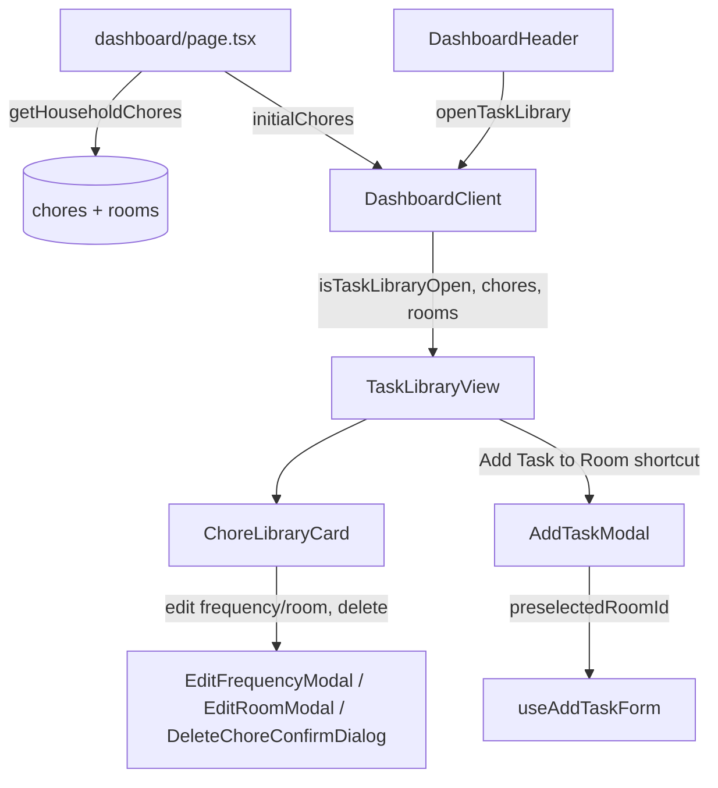

# Requirements

### Overview & Goals
Households currently see chores only through the calendar-style dashboard (a specific day's due/completed assignments). There is no way to answer "have I actually created all the chores I need for the Kitchen?" without scrolling through many days. This feature adds a **Task Library**: a browsable, room-filterable list of every chore *template* that exists in the household, showing its recurring details (frequency, duration, privacy), decoupled from any specific due date.

### Scope
**In Scope**
- A new full-screen "Task Library" view, entered from the dashboard header, separate from the calendar/week view.
- Room filter chips (reusing the existing room-chip interaction pattern) to narrow the list to one room or view all.
- Per-chore detail card: title, room, frequency (+ custom interval), estimated duration, "just for me" privacy badge, and an at-a-glance signal of upcoming due status (next due date / no pending instance).
- A shortcut button that opens the existing Add Task form pre-filled with the currently filtered room, so a gap can be filled immediately.
- Reuse of existing edit-frequency / edit-room / delete-chore actions and modals from the chore template.

**Out of Scope**
- Changing the existing calendar/week dashboard view or its data.
- Bulk editing/creating multiple chores at once.
- Any change to the AI schedule optimizer.

### User Stories
- As a household member, I want to see every chore that has been created for a given room, so I can check nothing is missing.
- As a household member, I want to filter the task list by room, so I can review one room at a time.
- As a household member, I want to see a chore's frequency and estimated duration at a glance, so I understand the recurring workload without opening each one.
- As a household member, while browsing a room's chores, I want a one-tap shortcut to add a new chore to that same room, so I can quickly fill gaps I notice.

### Functional Requirements
- The Task Library is opened via a new icon button in `DashboardHeader` and renders as a full-screen overlay (distinct from the existing bottom-drawer modals used for forms).
- It lists **chore templates** (one entry per chore), not per-day assignment instances — a chore that recurs daily still appears once.
- Private ("just for me") chores are only shown to the user they belong to, matching the existing visibility rule used elsewhere.
- The room filter defaults to "All" and uses the same rooms already loaded for the dashboard.
- Selecting a specific room surfaces an "Add Task to {Room}" button; with "All" selected, a generic "Add Task" button is shown instead. Both open the existing `AddTaskModal` flow.
- Existing per-chore actions (edit frequency, change room, delete chore) remain available from the library view.

# Technical Design

### Current Implementation
- `app/dashboard/page.tsx` fetches everything server-side via `Promise.all` over `lib/actions/*` and passes it into `DashboardClient` as `initial*` props.
- `lib/actions/chore-actions.ts` currently only exposes `getHouseholdTasks()`, which returns one row **per `chore_assignments` row** (i.e. per due-dated instance), joined with `chores`/`rooms`/`users`. There is no action that returns the *distinct chore templates* independent of assignments.
- `dashboard-client.tsx` orchestrates all state via one hook per concern under `lib/dashboard/hooks/*`, and renders presentational components from `app/dashboard/components/*`, with all dialogs as `AnimatePresence`-wrapped bottom drawers (see `AddTaskModal`, `EditFrequencyModal`, `EditRoomModal`).
- `RoomFilterBar.tsx` already implements the room-chip filter interaction (including the synthetic `{id:"all"}` room prepended in `dashboard-client.tsx`) — this is the pattern to reuse for the Task Library's own filter, but with independent state so it doesn't interfere with the calendar view's `selectedRoom`.
- `useAddTaskForm(selectableRooms)` owns the Add Task form's state; `openAddTask()` currently always defaults the room to `selectableRooms[0]`, with no way to pre-select a specific room.
- `useTaskModals()` owns edit-frequency/edit-room/delete state, typed against the assignment-shaped `Task` interface (`lib/dashboard/types.ts`), but its modals (`EditFrequencyModal`, `EditRoomModal`, `DeleteChoreConfirmDialog`) only ever read `title`, `chore_id`, `frequency`, `frequency_interval`, and `room_id` off that object — i.e. they don't structurally require full assignment fields.

### Key Decisions (confirmed with user)
1. **Data source**: add a new dedicated server action `getHouseholdChores()` that queries the `chores` table directly (joined with `rooms`), returning one canonical row per chore template — accurate even for a chore with no current pending instance, and consistent with how `getRooms()`/`getHouseholdUsers()` already work.
2. **Presentation**: the Task Library is a **full-screen slide-in overlay** (its own top-level component), not a bottom-sheet drawer — appropriate for a scrollable, browsable list rather than a short form.
3. **Room filtering**: reuse the **chip-based single-room filter** pattern from `RoomFilterBar` (pick one room, or "All", see a flat list) rather than expandable per-room accordions.

### Data Models / Contracts
New `Chore` type in `lib/dashboard/types.ts`:
```ts
export interface Chore {
  id: string; // chores.id
  title: string;
  room_id: string | null;
  room_name: string | null;
  room_icon_name: string | null;
  estimated_duration_minutes: number | null;
  frequency: ChoreFrequency;
  frequency_interval: number | null;
  private_to_user_id: string | null;
  is_private: boolean;
  next_due_date: string | Date | null; // earliest pending assignment, if any
}
```
New action in `lib/actions/chore-actions.ts`:
```ts
export async function getHouseholdChores(): Promise<Chore[]> {
  // SELECT c.*, r.name as room_name, r.icon_name as room_icon_name,
  //   MIN(ca.due_date) FILTER (WHERE ca.status = 'pending') as next_due_date
  // FROM chores c
  // LEFT JOIN rooms r ON c.room_id = r.id
  // LEFT JOIN chore_assignments ca ON ca.chore_id = c.id
  // WHERE c.household_id = :activeHouseholdId
  //   AND (c.private_to_user_id IS NULL OR c.private_to_user_id = :dbUserId)
  // GROUP BY c.id, r.name, r.icon_name
  // ORDER BY r.name NULLS LAST, c.title
}
```
To avoid re-typing the edit modals, introduce a small structural type both `Task` and `Chore` satisfy, used by `useTaskModals`/`EditFrequencyModal`/`EditRoomModal`/`DeleteChoreConfirmDialog` where only template-level fields are actually read:
```ts
export type ChoreLike = Pick<Task, 'chore_id' | 'title' | 'frequency' | 'frequency_interval' | 'room_id'>;
```
(`Task` already satisfies this via structural typing; the Task Library will pass a small adapter object built from `Chore` — `{ chore_id: chore.id, title, frequency, frequency_interval, room_id }` — into the same modals, so no modal code needs to change.)

### Components
- **`app/dashboard/components/TaskLibraryView.tsx`** *(new)* — full-screen overlay (`AnimatePresence`-driven like other overlays, but covering the whole viewport rather than a bottom sheet). Renders a header ("Task Library" + close button), a room filter chip row, the flat chore list, and the contextual "Add Task to {Room}" / "Add Task" shortcut button.
- **`app/dashboard/components/ChoreLibraryCard.tsx`** *(new)* — presentational card per chore: room badge, private badge (reusing the same badge styles as `TaskCard.tsx`), title, frequency label (via existing `FREQUENCY_OPTIONS`), duration, next-due summary, and the existing edit-frequency/edit-room/delete icon actions.
- **`app/dashboard/components/DashboardHeader.tsx`** *(modified)* — add a new icon button (e.g. `ClipboardList` from `lucide-react`) next to the existing header actions, wired to a new `openTaskLibrary` prop.
- **`lib/dashboard/hooks/useTaskLibrary.ts`** *(new)* — owns `isTaskLibraryOpen` and the library's own `selectedLibraryRoom` state, independent of the calendar view's `selectedRoom`/`useViewPreferences`.
- **`lib/dashboard/hooks/useAddTaskForm.ts`** *(modified)* — `openAddTask` accepts an optional `preselectedRoomId?: string` used to seed `newTaskRoomId`, so the library's shortcut can hand off directly into `AddTaskModal`.
- **`app/dashboard/dashboard-client.tsx`** *(modified)* — wires `useTaskLibrary`, fetches/holds `chores` from a new `initialChores` prop, renders `TaskLibraryView` inside the existing `AnimatePresence` block, and passes `openAddTask(roomId)` through as the shortcut handler.
- **`app/dashboard/page.tsx`** *(modified)* — adds `getHouseholdChores()` to the existing `Promise.all` and passes `initialChores` down.

### Architecture Diagram


### Risks
- **Visual/UX polish**: the exact layout of the full-screen overlay and card design should be delegated to the `ux-designer` sub-agent for a convenient, distinctive result rather than an ad-hoc reimplementation of existing modal styles.
- **Modal reuse mismatch**: `EditFrequencyModal`/`EditRoomModal`/`DeleteChoreConfirmDialog` are typed against `Task`; passing a `Chore`-derived adapter object must satisfy exactly the fields those modals read (confirmed by inspection) to avoid TypeScript friction.
- **Private chore visibility**: `getHouseholdChores()` must apply the same `private_to_user_id` filter as `getHouseholdTasks()` to avoid leaking another member's private chores into the library.

# Delivery Steps

### ✓ Step 1: Add getHouseholdChores server action and Chore data model
The backend can return one row per chore template (not per assignment), scoped to the active household and respecting private-chore visibility.

- Add `Chore` interface to `lib/dashboard/types.ts`.
- Implement `getHouseholdChores()` in `lib/actions/chore-actions.ts`: joins `chores` with `rooms`, aggregates the earliest pending `chore_assignments.due_date` per chore as `next_due_date`, filters by `household_id` and the existing `private_to_user_id` visibility rule.
- Wire it into `app/dashboard/page.tsx`'s `Promise.all` and pass the result to `DashboardClient` as `initialChores`.
- Extend `lib/actions/chore-actions.test.ts` with coverage for the new query's household scoping and private-chore filtering.

### ✓ Step 2: Add Task Library state hook and room-preselect support to Add Task
New reusable state is available to drive the Task Library overlay and to pre-fill the Add Task form with a specific room.

- Create `lib/dashboard/hooks/useTaskLibrary.ts` owning `isTaskLibraryOpen`/`setIsTaskLibraryOpen` and an independent `selectedLibraryRoom`/`setSelectedLibraryRoom` (defaulting to `"all"`), plus an `openTaskLibrary()` helper.
- Modify `useAddTaskForm.openAddTask` to accept an optional `preselectedRoomId` argument, seeding `newTaskRoomId` with it when provided (falling back to current default behavior otherwise).
- Add/update co-located hook tests (`useTaskLibrary.test.ts`, `useAddTaskForm.test.ts`) covering the new state and the room-preselect behavior.

### ✓ Step 3: Build the TaskLibraryView overlay and ChoreLibraryCard
A new full-screen overlay lets users browse every created chore, filter by room, and see its recurring details.

- Create `app/dashboard/components/ChoreLibraryCard.tsx`: displays room badge, private badge, title, frequency label (via `FREQUENCY_OPTIONS`), estimated duration, and next-due summary, plus edit-frequency/edit-room/delete icon actions reusing the existing handlers.
- Create `app/dashboard/components/TaskLibraryView.tsx`: full-screen `AnimatePresence` overlay with a header/close button, a room filter chip row (reusing the `RoomFilterBar` chip visual pattern against the library's own `selectedLibraryRoom` state), the filtered flat list of `ChoreLibraryCard`s, and the contextual "Add Task to {Room}" / "Add Task" shortcut button.
- Delegate the detailed visual/interaction polish of both components to the `ux-designer` sub-agent, providing it the confirmed layout decisions (full-screen overlay, chip-based room filter, flat card list).
- Add a component test (`TaskLibraryView.test.tsx`) covering room filtering and the add-task shortcut firing with the correct room id.

### ✓ Step 4: Wire the Task Library into the dashboard and header
Users can open the Task Library from the dashboard header, browse/filter chores, and use the shortcut to add a new one to the currently filtered room.

- Add a new icon button to `app/dashboard/components/DashboardHeader.tsx` (e.g. `ClipboardList` from `lucide-react`) wired to a new `openTaskLibrary` prop.
- In `app/dashboard/dashboard-client.tsx`: consume `initialChores`, instantiate `useTaskLibrary`, render `TaskLibraryView` within the existing `AnimatePresence` block, and wire its edit-frequency/edit-room/delete actions to the existing handlers via the `ChoreLike` adapter objects.
- Wire the library's "Add Task to {Room}" shortcut to call `openAddTask(selectedLibraryRoom)` and close the library overlay, handing off into the existing `AddTaskModal` flow.
- Update `dashboard-client.test.tsx` to cover opening the Task Library from the header and the add-task-shortcut handoff.